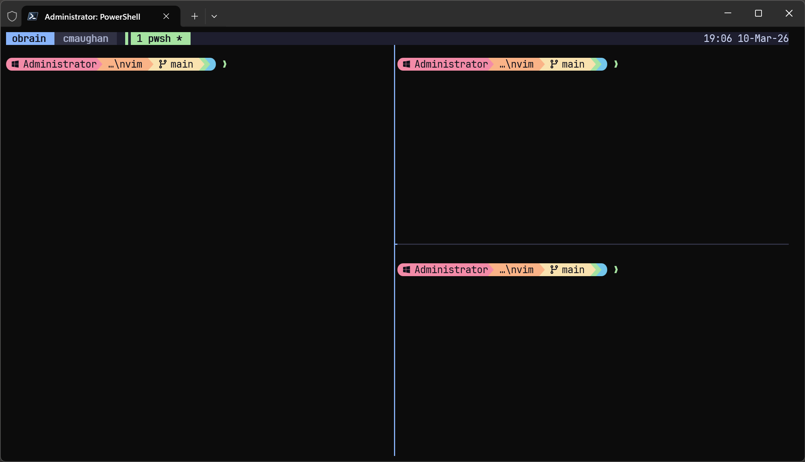
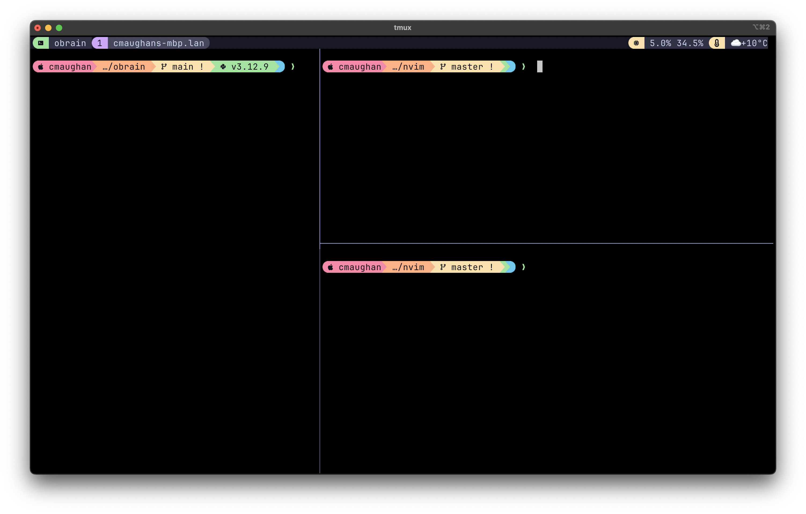

# My Config, Mac & PC

Cross-platform development environment — Neovim, shell, terminal multiplexer, formatters, linters, and LSP — that stays in sync across Windows and macOS. Uses [lazy.nvim](https://github.com/folke/lazy.nvim) for plugin management.

## Quick Start

Clone the repo and run the bootstrap script. It installs every tool, sets up Python/Node/Rust, copies config templates, and installs fonts — all idempotently (safe to re-run).

**Windows** (run in an elevated `cmd.exe`):
```bat
git clone <repo-url> "%LOCALAPPDATA%\nvim"
cd "%LOCALAPPDATA%\nvim"
install.bat
```

**Mac / Linux:**
```sh
git clone <repo-url> ~/.config/nvim
cd ~/.config/nvim
./install.sh
```

### What `install` does

1. **Installs CLI tools** — Neovim, Git, Node, ripgrep, fd, fzf, Starship, eza, bat, zoxide, uv, Rust, CMake, Ninja, Doxygen, Graphviz, clang-uml, PlantUML (via winget/choco on Windows, brew on Mac)
2. **Sets up Python** — installs Python 3.12 via `uv`, creates a dedicated `python-global` venv, installs `pynvim`
3. **Sets up Node** — installs the `neovim` npm provider and AI CLI tools (Claude Code, Codex, Gemini)
4. **Copies config templates** — PowerShell profile / `.zshrc`, `starship.toml`, `.tmux.conf` (backs up existing files that differ)
5. **Installs JetBrainsMono Nerd Font**
6. **Installs PowerShell modules** — PSFzf for fzf shell integration

After install, open Neovim — lazy.nvim bootstraps itself, installs all plugins, and Mason auto-installs LSP servers, formatters, and linters on first launch.

### Validating your setup

Run `doctor` to check environment health without changing anything:

**Windows:**
```bat
doctor.bat
```

**Mac / Linux:**
```sh
./doctor.sh
```

It verifies every tool is on PATH (with versions), checks that config files match their templates, confirms the Python/Node providers work, validates lazy.nvim and Mason are installed, and checks for the Nerd Font. Each check shows `[OK]`, `[WARN]`, or `[MISSING]` with install instructions for anything that's absent.

---

## Screenshots

### PC

[](./Screenshot-pc.png)

### Mac

[](./Screenshot-mac.png)

---

## Structure

```
~/.config/nvim/
├── init.lua                    # Entry point
├── ginit.vim                   # GUI-specific Neovim settings
├── vsinit.vim                  # Minimal Vim-style fallback config
├── karabiner.json              # Mac keyboard remap snippet
├── lua/
│   ├── options.lua             # Vim options
│   ├── keymaps.lua             # Key mappings
│   ├── plugins.lua             # Plugin declarations (lazy.nvim)
│   ├── session.lua             # Project session persistence
│   ├── util/
│   │   ├── keymap.lua          # Shared keymap helper / duplicate guard
│   │   └── paths.lua           # Shared path helpers / Python provider resolution
│   └── plugin_config/          # Per-plugin configuration
│       ├── init.lua            # (intentionally empty — configs loaded via lazy.nvim)
│       ├── dap.lua             # DAP debugger (nvim-dap, codelldb for C/C++/Rust)
│       ├── lsp.lua             # LSP + mason-lspconfig
│       ├── formatting.lua      # Formatting via conform.nvim
│       ├── linting.lua         # Linting via nvim-lint
│       ├── treesitter.lua      # Treesitter
│       ├── telescope.lua       # Fuzzy finder
│       ├── completions.lua     # nvim-cmp
│       ├── mason.lua           # Mason + tool installer
│       ├── colorscheme.lua     # Colorscheme
│       ├── copilot.lua         # GitHub Copilot
│       ├── aerial.lua          # Code outline
│       ├── gitsigns.lua        # Git signs
│       ├── harpoon.lua         # Harpoon
│       ├── leap.lua            # Leap motion
│       ├── lualine.lua         # Status line
│       ├── markdown_preview.lua# Markdown preview
│       ├── mini-files.lua      # Mini file explorer
│       ├── neotest.lua         # Test runner integration
│       ├── obsidian.lua        # Obsidian integration
│       ├── pre-init.lua        # Pre-init hooks
│       ├── quickfix.lua        # Quickfix
│       ├── rustaceanvim.lua    # Rust tools
│       ├── scratch.lua         # Scratch buffer
│       ├── twilight.lua        # Twilight (focus mode)
│       ├── ufo.lua             # Folding
│       ├── which_key.lua       # Which-key
│       └── zen_mode.lua        # Zen mode
├── Screenshot-mac.png          # Mac reference screenshot
├── Screenshot-pc.png           # Windows reference screenshot
├── zshrc.template              # Mac shell config template (zsh)
├── profile.ps1.template        # Windows shell config template (PowerShell)
├── starship.toml.template      # Starship prompt config (all platforms)
├── tmux.conf.template          # tmux config template (Mac)
└── tmux.windows.conf.template  # tmux/psmux config template (Windows)
```

---

## Prerequisites

### Mac

Install packages via [Homebrew](https://brew.sh):

```sh
brew install neovim
brew install git
brew install ripgrep       # telescope live_grep
brew install fd            # telescope file search
brew install fzf           # fzf.zsh shell integration
brew install node          # markdown-preview, LSP servers
brew install starship      # shell prompt
brew install eza           # ls replacement (aliased in .zshrc)
brew install bat           # cat replacement (aliased in .zshrc)
brew install tmux          # terminal multiplexer
brew install uv            # Python version manager + package installer
brew install zoxide        # smart directory jumping (z command)
brew install btop          # system monitor (CPU, RAM, disk, network)
brew install graphviz      # dot / dependency graph rendering
brew install clang-uml     # UML diagram generation from C++ source
brew install plantuml      # PlantUML renderer (used by gen_uml.py)
brew install cmake         # build system
```

#### Optional (Mac)

```sh
brew install mactex        # for vimtex / LaTeX support
brew install openscad      # for vim-openscad support
```

---

### Windows

Install [Chocolatey](https://chocolatey.org/install) (run in an elevated PowerShell):

```powershell
Set-ExecutionPolicy Bypass -Scope Process -Force
[System.Net.ServicePointManager]::SecurityProtocol = [System.Net.ServicePointManager]::SecurityProtocol -bor 3072
iex ((New-Object System.Net.WebClient).DownloadString('https://community.chocolatey.org/install.ps1'))
```

Install packages via [winget](https://learn.microsoft.com/en-us/windows/package-manager/winget/) (built into Windows 11):

```powershell
winget install Neovim.Neovim
winget install Git.Git
winget install BurntSushi.ripgrep.MSVC   # telescope live_grep
winget install sharkdp.fd                # telescope file search
winget install junegunn.fzf              # fzf integration
winget install OpenJS.NodeJS             # markdown-preview, LSP servers
winget install Starship.Starship         # shell prompt
winget install eza-community.eza         # ls replacement
winget install sharkdp.bat              # cat replacement
winget install astral-sh.uv              # Python version manager + package installer
winget install ajeetdsouza.zoxide        # smart directory jumping (z command)
winget install aristocratos.btop4win     # system monitor (CPU, RAM, disk, network)
winget install Graphviz.Graphviz         # dot / dependency graph rendering
winget install bkryza.clang-uml         # UML diagram generation from C++ source
choco install plantuml                   # PlantUML renderer (used by gen_uml.py)
winget install Kitware.CMake             # build system
```

Install [psmux](https://github.com/marlocarlo/psmux) for terminal multiplexing (tmux-compatible, written in Rust):

```powershell
winget install psmux
```

Install the PSFzf PowerShell module for fzf shell integration:

```powershell
Install-Module PSFzf
```

#### Optional (Windows)

```powershell
winget install MiKTeX.MiKTeX     # for vimtex / LaTeX support
winget install OpenSCAD.OpenSCAD # for vim-openscad support
```

---

### Python (all platforms)

Python is managed by [uv](https://github.com/astral-sh/uv) — a fast Rust-based tool that replaces pyenv, pip, and virtualenv.

Install Python 3.12.9 and set it as the global default:

```sh
uv python install 3.12.9
uv python pin 3.12.9
```

Create a global virtualenv, install pynvim into it, and add its `Scripts` dir to your PATH:

**Windows:**
```powershell
uv venv --python 3.12.9 "$env:LOCALAPPDATA\python-global"
uv pip install --python "$env:LOCALAPPDATA\python-global\Scripts\python.exe" pip pynvim
# Add to PATH (run once):
$p = [System.Environment]::GetEnvironmentVariable("PATH","User") -split ";"
[System.Environment]::SetEnvironmentVariable("PATH", ("$env:LOCALAPPDATA\python-global\Scripts;" + ($p -join ";")), "User")
```

**Mac / Linux:**
```sh
uv venv --python 3.12.9 ~/.local/share/nvim-venv
uv pip install --python ~/.local/share/nvim-venv/bin/python pip pynvim
```

The venv bin is already on PATH via the `zshrc.template` (`~/.local/share/nvim-venv/bin`).

On macOS/Linux, add a `py` alias to your shell config so `py` works like on Windows:

```sh
alias py=python3
```

### npm packages (all platforms)

```sh
npm install -g neovim      # Neovim Node.js provider
```

---

## Neovim Setup

### Mac

1. Clone this repo to `~/.config/nvim`
2. Open Neovim — lazy.nvim will bootstrap itself and install all plugins automatically
3. Mason will install LSP servers and formatter/linter tools on first start, or run `:MasonToolsInstall` manually

### Windows

1. Clone this repo to `~\AppData\Local\nvim`

```powershell
git clone <repo-url> "$env:LOCALAPPDATA\nvim"
```

2. Open Neovim — lazy.nvim will bootstrap and install all plugins automatically
3. Mason will install LSP servers and formatter/linter tools on first start, or run `:MasonToolsInstall` manually

### LSP servers (via Mason)

Automatically installed via `mason-lspconfig`:
- `lua_ls` — Lua
- `rust_analyzer` — Rust
- `clangd` — C/C++
- `neocmake` — CMake

Configured, but not auto-installed:
- `openscad_lsp` — OpenSCAD (install manually via Mason if needed)

### Debug adapters (via Mason)

Automatically installed via `mason-nvim-dap`:
- `codelldb` — C, C++, and Rust (via `nvim-dap` + `nvim-dap-ui`)

Debugger keybindings (all under `<leader>d`):

| Key          | Action                        |
|--------------|-------------------------------|
| `<leader>db` | Toggle breakpoint             |
| `<leader>dB` | Conditional breakpoint        |
| `<leader>dc` | Continue                      |
| `<leader>di` | Step into                     |
| `<leader>do` | Step over                     |
| `<leader>dO` | Step out                      |
| `<leader>dq` | Terminate session             |
| `<leader>dr` | Restart session               |
| `<leader>dl` | Run last config               |
| `<leader>du` | Toggle DAP UI                 |
| `<leader>de` | Eval expression (normal/visual)|
| `<leader>dh` | Hover value under cursor      |

The UI opens automatically when a debug session starts and closes when it ends.

### Rust

**Mac / Linux:**

```sh
curl --proto '=https' --tlsv1.2 -sSf https://sh.rustup.rs | sh
```

**Windows:**

```powershell
winget install Rustlang.Rustup
```

`rust_analyzer` will be handled by Mason, but the Rust toolchain itself must be present.

### Formatting and linting

Formatting is handled by `conform.nvim`; linting is handled by `nvim-lint`.

- `:Format` or `<leader>lf` — format the current buffer
- `:Lint` or `<leader>ll` — lint the current buffer

Configured formatters:
- Lua: `stylua`
- Python: `ruff format`
- Rust: `rustfmt`
- C/C++: `clang-format`
- JSON / YAML: `prettierd` (with `prettier` fallback)
- Markdown: `prettierd` — format on save for all markdown **except** files inside the Obsidian vault path
- TOML: `taplo`
- Shell: `shfmt`

Configured linters:
- JSON: `jsonlint`
- YAML: `yamllint`
- Markdown: `markdownlint`
- Python: `ruff`
- Shell: `shellcheck`

### Project sessions

Project sessions are stored under `stdpath('state')/sessions` and keyed by git root when available, otherwise by the current working directory.

- Auto-restore runs only when Neovim starts with no file arguments
- Auto-save runs on exit
- `:SessionSave` or `<leader>ps` saves the current project session
- `:SessionRestore` or `<leader>pr` restores the current project session
- `:SessionRestore!` forces a restore even if you have modified buffers
- `:SessionDelete` or `<leader>px` deletes the current project session file

---

## Shell Setup

### Mac (zsh)

Copy `zshrc.template` to `~/.zshrc`. Dropbox path is auto-detected from `~/.dropbox/info.json`.

After installing `fzf` via brew, run the shell integration installer:

```sh
$(brew --prefix)/opt/fzf/install
```

This creates `~/.fzf.zsh` which is sourced by the `.zshrc` template.

### Windows (PowerShell)

Copy `profile.ps1.template` to your PS7 (`pwsh`) profile:

```powershell
Copy-Item profile.ps1.template "$HOME\Documents\PowerShell\Microsoft.PowerShell_profile.ps1"
```

If execution policy blocks the profile, enable it once:

```powershell
Set-ExecutionPolicy -ExecutionPolicy RemoteSigned -Scope CurrentUser
```

The template also imports the Chocolatey profile module and `PSFzf`, so both need to be installed before the profile will load cleanly.

### Starship prompt (all platforms)

Copy `starship.toml.template` to `~/.config/starship.toml`:

**Mac / Linux:**
```sh
cp starship.toml.template ~/.config/starship.toml
```

**Windows:**
```powershell
cp starship.toml.template "$HOME\.config\starship.toml"
```

The config uses the **catppuccin-powerline** preset. It requires **JetBrainsMono Nerd Font Mono**.

Install on Mac via Homebrew:
```sh
brew install --cask font-jetbrains-mono-nerd-font
```

Set the font in your terminal emulator:
- **Mac (iTerm2):** Preferences → Profiles → Text → Font → select `JetBrainsMono Nerd Font Mono`
- **Mac (Warp):** Settings → Appearance → Terminal Font
- **Windows Terminal:** Settings → your profile → Appearance → Font face
> **Windows note:** the PowerShell template adds the WinGet-installed `uv` path dynamically, and `command_timeout = 5000` keeps Starship tolerant of slower version probes.

### Windows Terminal color scheme

Set the color scheme to **Dimidium** (Settings → your profile → Appearance → Color scheme) for well-balanced ANSI colors that work well with eza, starship, and Neovim.

### zoxide (all platforms)

`zoxide` is already configured in both shell templates. It learns your most-used directories over time.

```sh
z foo        # jump to most frecent directory matching "foo"
z foo bar    # match multiple terms
zi foo       # interactive fuzzy search (requires fzf)
```

Just use `cd` normally at first — zoxide builds its database from your navigation history.

---

## Neovim Terminal

A persistent terminal is provided by `toggleterm.nvim`:

- `<C-\>` — toggle a horizontal terminal split (state is preserved between toggles)
- `<Esc>` in terminal mode — return to normal mode
- `<C-h/j/k/l>` in terminal mode — navigate to adjacent splits (via smart-splits)

## Optional Platform Files

- `ginit.vim` is used by Neovim GUIs such as Neovide and sets the GUI font, mouse behavior, and font-size keybindings.
- `vsinit.vim` is a small Vim-style fallback config with basic movement and search mappings.
- `karabiner.json` is a Karabiner-Elements profile snippet for Mac keyboard remaps.

---

## Terminal Multiplexer

### Mac (tmux)

Copy `tmux.conf.template` to `~/.tmux.conf`.

Install [TPM](https://github.com/tmux-plugins/tpm) (tmux plugin manager):

```sh
git clone https://github.com/tmux-plugins/tpm ~/.tmux/plugins/tpm
```

Then open tmux and press `prefix + I` (Ctrl-s + I) to install plugins:
- `vim-tmux-navigator` — seamless pane navigation between tmux and Neovim
- `catppuccin/tmux` — Catppuccin Mocha status bar theme with rounded separators (v2.x API)
- `tmux-cpu` — provides `#{cpu_percentage}` and `#{ram_percentage}` for the status bar
- `tmux-weather` — weather in the status bar (location: York, °C) via `xamut/tmux-weather`
- `tmux-resurrect` — save/restore sessions manually (`prefix + Ctrl-s` to save, `prefix + Ctrl-r` to restore)
- `tmux-continuum` — auto-saves session every 15 min; restores automatically on tmux start
- `tmux-prefix-highlight` — highlights status bar when prefix key is active

> **Catppuccin v2.x note:** The plugin must be loaded with `run` *before* setting `status-left`/`status-right`, and TPM must `run` *after*. Use `set -gF`/`set -agF` with `#{E:@catppuccin_status_<module>}` for status modules. Use `#{l:#{var}}` in any custom module text to prevent early expansion of tmux-cpu variables.

Prefix is bound to `Ctrl-s`. Key highlights:
- `prefix + |` / `prefix + -` — split pane horizontally / vertically
- `prefix + h/j/k/l` — navigate panes (vim-style)
- `prefix + Enter` — enter copy mode; `v` to select, `y` to copy to clipboard
- `prefix + Ctrl-s` / `prefix + Ctrl-r` — save / restore session (tmux-resurrect)

### Windows (psmux)

[psmux](https://github.com/marlocarlo/psmux) is a native Windows terminal multiplexer written in Rust. It is tmux-compatible (76 tmux commands supported), reads your existing `.tmux.conf`, and ships `tmux`/`pmux` aliases so muscle memory transfers directly from Mac.

```powershell
winget install psmux
```

Install [PPM](https://github.com/marlocarlo/psmux-plugins) and plugins:

```powershell
git clone --depth 1 https://github.com/marlocarlo/psmux-plugins.git "$env:TEMP\psmux-plugins"
Copy-Item "$env:TEMP\psmux-plugins\ppm" "$HOME\.psmux\plugins\ppm" -Recurse
Copy-Item "$env:TEMP\psmux-plugins\psmux-theme-catppuccin" "$HOME\.psmux\plugins\psmux-theme-catppuccin" -Recurse
Copy-Item "$env:TEMP\psmux-plugins\psmux-cpu" "$HOME\.psmux\plugins\psmux-cpu" -Recurse
Copy-Item "$env:TEMP\psmux-plugins\psmux-resurrect" "$HOME\.psmux\plugins\psmux-resurrect" -Recurse
Copy-Item "$env:TEMP\psmux-plugins\psmux-continuum" "$HOME\.psmux\plugins\psmux-continuum" -Recurse
Copy-Item "$env:TEMP\psmux-plugins\psmux-prefix-highlight" "$HOME\.psmux\plugins\psmux-prefix-highlight" -Recurse
Remove-Item "$env:TEMP\psmux-plugins" -Recurse -Force
```

Remove `~\.psmux.conf` if it exists — psmux checks for it before `~\.tmux.conf` and will ignore your tmux config if both are present:

```powershell
Remove-Item "$HOME\.psmux.conf" -ErrorAction SilentlyContinue
```

Copy `tmux.windows.conf.template` to `~\.tmux.conf`:

```powershell
cp tmux.windows.conf.template "$HOME\.tmux.conf"
```

Plugins:
- `psmux-theme-catppuccin` — Catppuccin Mocha status bar theme (powerline, rounded separators); status modules configured via `@catppuccin-status-modules-right`
- `psmux-cpu` — CPU% and RAM usage in the status bar (`cpu` and `ram` modules)
- `psmux-resurrect` — save/restore sessions manually (`prefix + Ctrl-s` to save, `prefix + Ctrl-r` to restore)
- `psmux-continuum` — auto-saves session every 15 min; restores automatically on psmux start
- `psmux-prefix-highlight` — highlights status bar when prefix key is active
Prefix is bound to `Ctrl-s`. Key highlights:
- `prefix + |` / `prefix + -` — split pane horizontally / vertically
- `prefix + h/j/k/l` — navigate panes (vim-style)
- `prefix + Enter` — enter copy mode; `v` to select, `y` to copy to clipboard
- `prefix + Ctrl-s` / `prefix + Ctrl-r` — save / restore session (psmux-resurrect)
